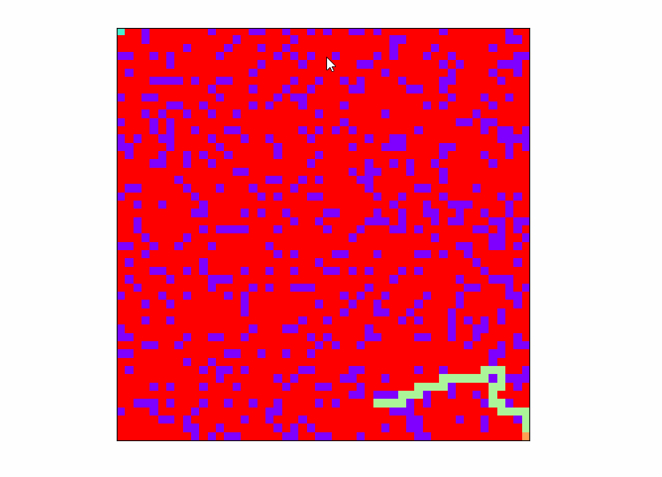

## visual algorithm

可视化算法

### 深度优先算法

深度优先算法(DFS 算法)是什么？

寻找起始节点与目标节点之间路径的算法，常用于搜索逃出迷宫的路径。主要思想是，从入口开始，依次搜寻周围可能的节点坐标，但不会重复经过同一个节点，且不能通过障碍节点。如果走到某个节点发现无路可走，那么就会回退到上一个节点，重新选择其他路径。直到找到出口，或者退到起点再也无路可走，游戏结束。当然，深度优先算法，只要查找到一条行得通的路径，就会停止搜索；也就是说只要有路可走，深度优先算法就不会回退到上一步。

